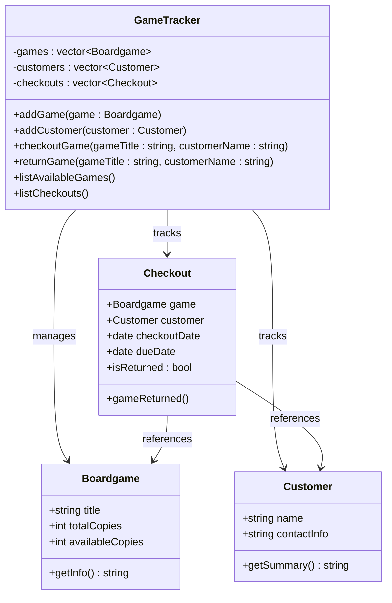

/*
Program Specification:
    The program is a Lending Tracker. It is designed to track what games there are in the shop, if they are available, and who has them if they are not. Upon checkout, the boardgame is given a checkout date and a due date, as well as a status indicating whether or not the boardgame has been returned and if it is overdue. The entities involved are the boardgames and customers.

Key Nouns:
    Boardgame
        title, totalCopies, availableCopies
    Customer
        name, contactInfo
    Checkout
        game, customer, checkoutDate, dueDate, isReturned
    GameTracker
        games, customers, checkouts
Key Verbs:
    gameInfo()
    
    customerInfo()
    
    gameReturned()

    addCustomer()
    addGame()
    listGames()
    checkoutGame()
    returnGame()
*/

//Boardgame.h
class Boardgame {
public:
    std::string title;
    int totalCopies;
    int availableCopies;

    Boardgame(std::string title, int totalCopies, int availableCopies);
    std::string getInfo() const;
};

//Customer.h
class Customer {
public:
    std::string name;
    std::string contactInfo;

    Customer(std::string name, std::string contactInfo);
    std::string getSummary() const;
};

//Checkout.h
class Checkout {
public:
    Boardgame* game;
    Customer* customer;
    std::tm checkoutDate;
    std::tm dueDate;
    bool isReturned;

    Checkout(Boardgame* title, Customer* customer, std::tm checkoutDate, std::tm dueDate, bool isReturned);
    void gameReturned();
};

//GameTracker.h
class GameTracker {
private:
    std::vector<Boardgame> games;
    std::vector<Customer> customers;
    std::vector<Checkout> checkouts;

public:
    void addGame(const Boardgame& game);
    void addCustomer(const Customer& customer);
    bool checkoutGame(const std::string& gameTitle, const std::string& customerName, const std::tm& checkoutDate, const std::tm& dueDate);
    bool returnGame(const std::string& gameTitle, const std::string& customerName);
    std::vector<std::string> listAvailableGames();
    std::vector<std::string> listCheckouts();
};

